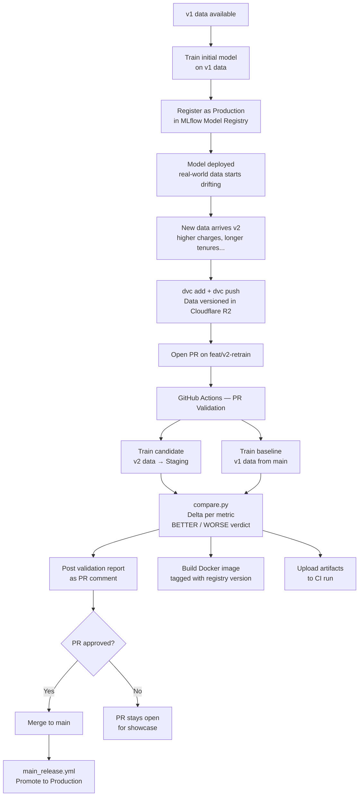
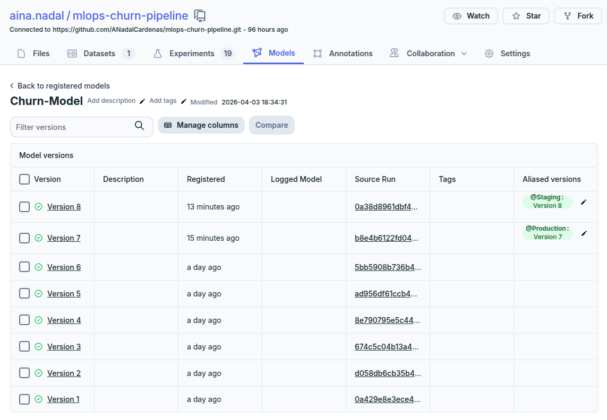
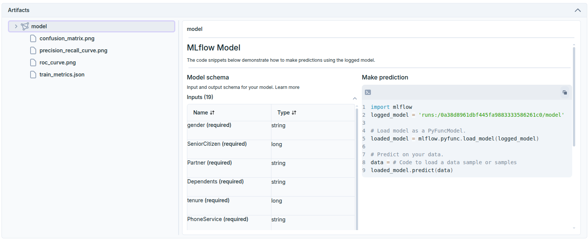

# MLOps Churn Pipeline

An end-to-end MLOps pipeline for customer churn prediction, built to demonstrate production-grade practices: data versioning, experiment tracking, CI-driven model comparison, model registry, and Docker packaging.

---

## What problem does this project solve?

A telecom company wants to predict which customers will churn. That is a standard ML problem. The harder problem — and the one this project addresses — is what happens *after* the first model is deployed: data evolves, models degrade silently, and teams need a reliable way to know whether a code change makes the model better or worse before it reaches production.

This project builds the infrastructure that answers those questions automatically, on every pull request.

---

## Pipeline overview



---

## Tech stack

| Layer | Tool |
|---|---|
| Data versioning | DVC + Cloudflare R2 |
| Experiment tracking | MLflow hosted on DagsHub |
| Model registry | MLflow Model Registry |
| CI/CD | GitHub Actions |
| Containerisation | Docker via `mlflow models build-docker` |
| ML | scikit-learn |
| Language | Python 3.11 |

---

## Project structure

```
├── src/
│   ├── data/           # Dataset loading and versioning logic
│   ├── features/       # Feature engineering
│   ├── training/       # Model training and MLflow logging
│   ├── evaluation/     # Metrics, plots, and model comparison
│   └── utils/          # Shared I/O helpers
├── pipelines/
│   └── orchestration.py   # Single CLI entrypoint for the full pipeline
├── data/
│   ├── v1.dvc             # Pointer to v1 dataset in R2
│   └── v2.dvc             # Pointer to v2 dataset in R2
├── .github/workflows/
│   ├── pr_validation.yml  # CI: train, compare, comment, build Docker
│   └── main_release.yml   # CI: promote to Production on merge
└── images/
```

---

## Data versioning

The project uses two dataset versions derived from the Telco Customer Churn dataset:

- **v1** — the original data, representing the state at initial deployment
- **v2** — a derived dataset simulating real-world drift: more customers, higher monthly charges, longer tenures, and a shift toward long-term contracts

Data files are never committed to Git. DVC stores a small metadata pointer (`.dvc` file) in the repository while the actual CSV files live in Cloudflare R2. This is the production standard for managing large data assets alongside code.

---

## CI/CD workflow

### On every pull request

When a PR is opened or updated, GitHub Actions automatically:

1. Trains the **candidate model** on v2 data and registers it as `Staging` in the MLflow Model Registry
2. Checks out `main` and trains the **baseline model** on v1 data
3. Runs `src/evaluation/compare.py` to compute metric deltas and apply a **BETTER / WORSE OR EQUAL** verdict (based on F1 and ROC AUC)
4. Posts the validation report as a PR comment — updated in place on re-runs, never duplicated
5. Builds a Docker image tagged with the registry version and commit SHA
6. Uploads all reports as downloadable CI artifacts

### On merge to main

The release workflow promotes the registered `Staging` model to `Production` and archives the previous version.

---

## Model registry

The MLflow Model Registry governs which version of the model is deployed at any point in time. Each version moves through lifecycle stages:

| Stage | Meaning |
|---|---|
| `Staging` | Validated on a PR, passed CI checks, not yet approved for production |
| `Production` | The currently deployed model |
| `Archived` | A previous production version, kept for auditability |



---

## MLflow artifacts

Every training run logs parameters, metrics, evaluation plots, and the serialised model to the remote MLflow tracking server on DagsHub. The model artifact also includes the input schema, enabling direct serving via the MLflow REST API.



---

## Running locally

```bash
# Install dependencies
pip install -r requirements.txt

# Pull versioned data
dvc pull

# Train on v1
python pipelines/orchestration.py \
  --data-version v1 \
  --experiment-name churn-local \
  --run-name my-run \
  --output-dir reports/local

# Compare candidate vs baseline
python src/evaluation/compare.py \
  --candidate reports/candidate/train_metrics.json \
  --baseline  reports/baseline/train_metrics.json \
  --output-dir reports/
```
